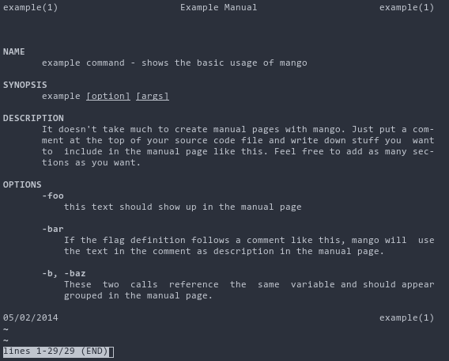

# mango

*Generate manual pages from the source code of your Go commands*

mango is a small command line utility that allows you to create manual
pages from the source code of your Go commands. It builds manual pages from
the comments and *flag* function calls found in your .go files.

#### Building

Execute
```bash
go build ./mango.go
```
to build mango.

#### Running

Pass one or more .go files as command line arguments to mango.
mango treats them as a list of independent Go commands and creates a
manual page for each argument.

```bash
mango file1.go file2.go ...
```

## Usage

#### Source File

```go
// example_command - shows the basic usage of mango
//
// Description:
//
// It doesn't take much to create manual pages with mango. Just put a comment
// at the top of your source code file and write down stuff you want to include
// in the manual page like this. Feel free to add as many sections as you want.
package main

import (
	"flag"
)

var (
	optFoo = flag.Bool("foo", false, "this text should show up in the manual page")

	// If the flag definition follows a comment like this, mango will use
	// the text in the comment as description in the manual page.
	optBar = flag.Bool("bar", false, "the above comment should show up in the manual page")
	optBaz = false
)

func init() {
	// These two calls reference the same variable and should appear
	// grouped in the manual page.
	flag.BoolVar(&optBaz, "baz", false, "two calls, but one entry in the manual")
	flag.BoolVar(&optBaz, "b", false, "two calls, but one entry in the manual")
}

func main() {
	return
}
```

#### Result



### License

mango is released under MIT license.
You can find a copy of the MIT License in the [LICENSE](./LICENSE) file.
